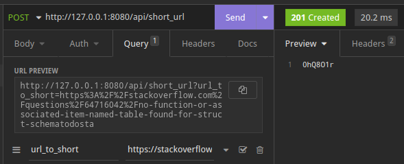
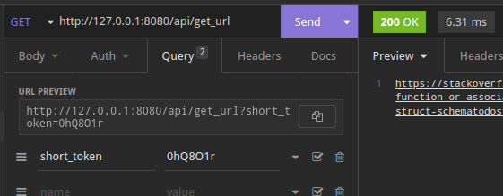

Simple service for URL shortening written in Rust 2021 edition and asynchronous web framework - actix-web, diesel orm


### Service API

---

**Short URL**  _POST_ Request

```
<service_url>/api/short_url
```

- provide URL for shortening in query body

Response

- *201 Created* - token
- *503 Service Unavailable*




**Get URL**  _GET_ Request

```
<service_url>/api/get_url
```

- provide token in query body

Response

- *200 OK* - url
- *404 Not Found*



---

